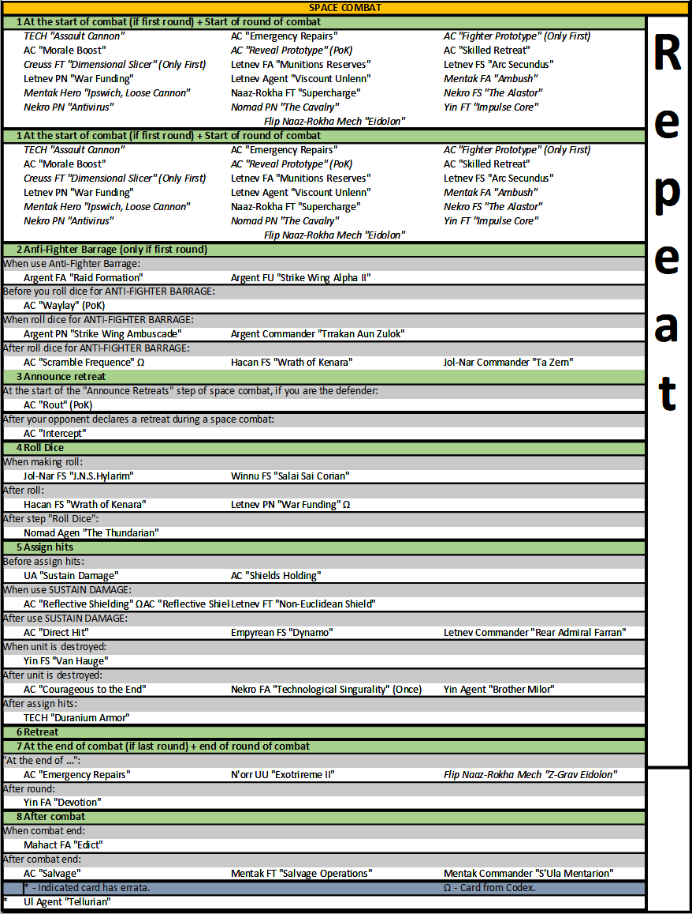

# Тайминги

## Сводная таблица таймингов



### Фаза действия \(Action Phase\)



### Фаза Агенды \(Agenda Phase\)



### Фаза Вторжения \(Invasion Phase\)



### Фаза Космического Боя \(Space Combat Phase\)



